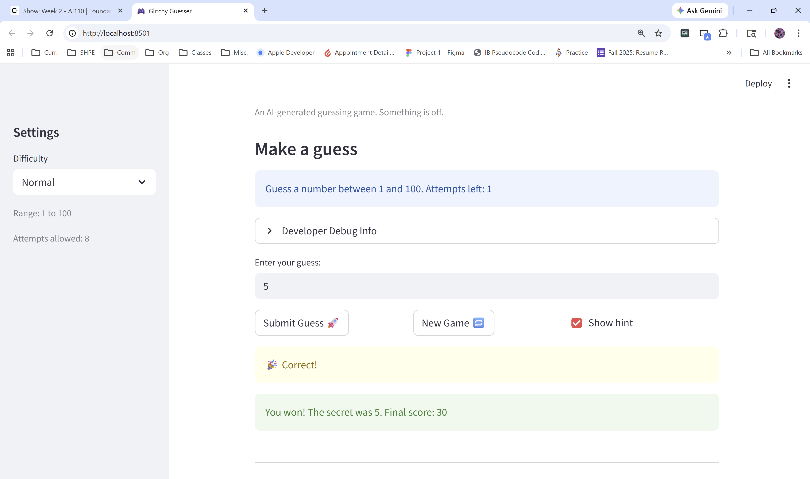
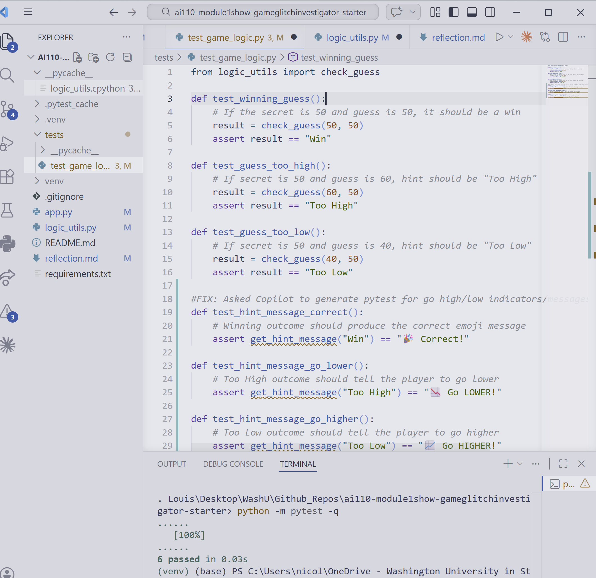

# Game Glitch Investigator

A Streamlit-based debugging and refactoring project where I investigated a broken AI-generated number guessing game, fixed state and game-logic issues, and added targeted tests to prevent regressions.

## Project Snapshot

This project started as a "glitchy" guessing game with multiple gameplay bugs:

- Hints could point in the wrong direction.
- Attempt flow was inconsistent in edge cases.
- Difficulty range behavior did not consistently match expected gameplay.

I treated this as a software-quality exercise: isolate logic, fix behavior, and validate with both automated tests and manual UI checks.

## What I Built

- A stable Streamlit app with session-based game state.
- Refactored game logic in reusable helper functions.
- Clear guess evaluation outcomes: `Win`, `Too High`, `Too Low`.
- Hint messaging mapped cleanly from outcomes.
- A score update function tied to outcomes and attempt count.
- Pytest coverage for core guess and hint behavior.

## Technical Highlights

### 1. State Management in Streamlit

The biggest reliability fix was ensuring game state persists across reruns. The app now uses `st.session_state` for:

- Secret number
- Attempts
- Score
- Game status (`playing`, `won`, `lost`)
- Guess history

This keeps the game predictable and prevents accidental resets during normal interactions.

### 2. Logic Refactor

Core game logic was moved into `logic_utils.py` to separate UI and business logic. This made the code easier to test and reason about.

Key functions include:

- `get_range_for_difficulty(difficulty)`
- `parse_guess(raw)`
- `check_guess(guess, secret)`
- `get_hint_message(outcome)`
- `update_score(current_score, outcome, attempt_number)`

### 3. Testing Strategy

I used focused pytest tests for high-value behavior:

- Correct win/too high/too low outcomes from `check_guess`
- Correct user-facing hint messages from `get_hint_message`

I also validated gameplay manually in Streamlit (including debug panel checks) to confirm end-to-end behavior.

## Tech Stack

- Python
- Streamlit
- Pytest

## Run Locally

1. Create and activate a virtual environment.
2. Install dependencies:

```bash
pip install -r requirements.txt
```

3. Launch the app:

```bash
python -m streamlit run app.py
```

4. Run tests:

```bash
pytest
```

## Repository Structure

```text
.
|-- app.py                  # Streamlit UI and session-state orchestration
|-- logic_utils.py          # Core parsing, game logic, hints, scoring
|-- tests/
|   `-- test_game_logic.py  # Unit tests for core behavior
|-- reflection.md           # Debugging and AI-collaboration notes
`-- requirements.txt
```

## Demo

Gameplay screenshots:




## Key Takeaways

- AI-generated code is a useful starting point, not a finish line.
- Streamlit rerun behavior requires intentional state design.
- Small, focused tests catch logic regressions quickly.
- Separating UI and logic improves maintainability and confidence.
